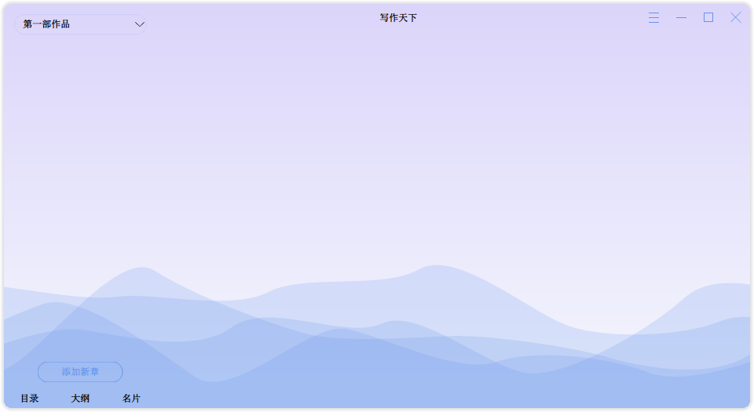
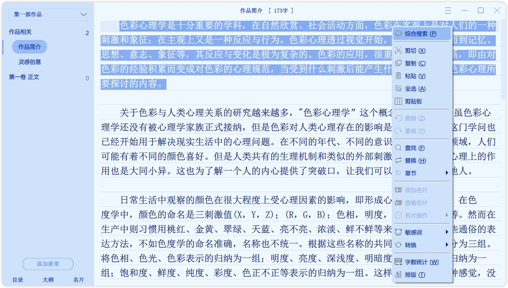
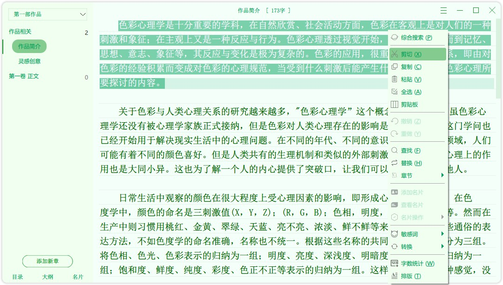
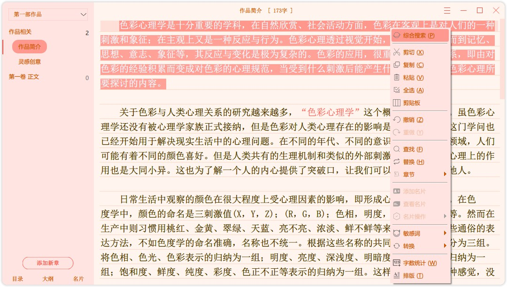
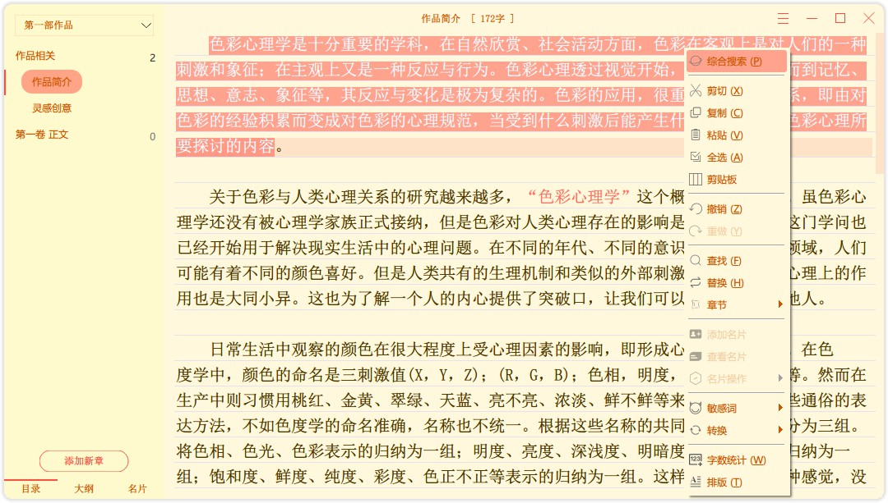
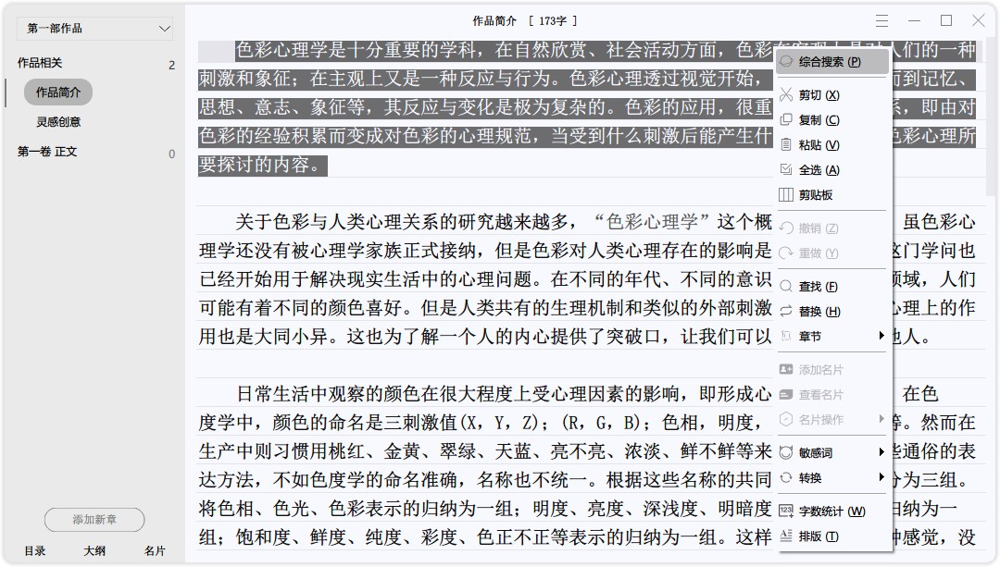
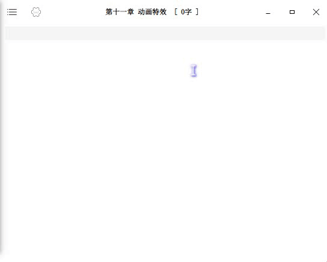

# 写作天下

## 简介

为作家们创造世界而诞生，执云作笔，诉尽平生意。

集简约UI与人性化AI于一体的码字工具，无论是小说、作文、日记、报告，都能轻松驾驭。

**QQ交流群：705849222**

---

## 功能

1. **自由的目录**：自动序号，拖拽排序，随意调整
2. **自定义界面**：全局自定义主题、风格，可使用CSS代码
3. **智能标点系统**：独有的强大又省力的标点 AI
   1. **智能引号**：增删移动全在一键之间
   2. **智能空格**：缩进、标点、移动光标融为一体
   3. **智能回车**：双引号内回车、自动添加句末标点、自动缩进
   4. **自动标点**：语气词后面自动加上标点符号
4. **名片库系统**：为文中所有人物、事物创建名片
   1. **名字高亮**，直观高效
   2. **鼠标悬浮**：随时查看简介与详情
   3. **章节出现**的名片一览
   4. **快速搜索**所有名片
5. **云端同步**：稳定、全自动，多一重保险。支持同步到手机。
6. **云排行榜**：所有用户在线拼字
7. **多线大纲**：主线/辅线/事件线/感情线…等
8. **语言高亮**：人物语言描写高亮显示
9. **章内标注**：章节内埋坑备注，可作细纲，导出、发布时自动去除
10. **高潮模式**：自动识别当前情节激烈程度，微调小说AI
11. **导入导出**：花样自定义格式，便捷的多文件拖拽导入导出
12. **字数统计**：精确到几个空格的数量
13. **同音词覆盖**：选词错误，无需删除，直接覆盖旧内容
14. **敏感词检测**：高亮所有敏感词，可自定义词库
15. **多功能替换**：简繁转换、敏感词替换、敏感词转拼音等
16. **自动分段**：换行/排版时，过长段落自动在合适的地方分段
17. **词语提示**：输入时自动提示同义词、相关词、常用句
18. **随机取名**：最轻便的取名方式，要啥来啥
19. **一键排版**：全自动，包括英文空格、首字母大写、长段落自动分段等
20. **资源搜索**：全局浏览所有资源文件，快速搜索
21. **小黑屋**：多种模式强制码字
22. **剪贴板**：保存所有复制的历史记录
23. **回收板**：记录所有删除/剪切的长文本，避免丢失
24. **小说类型**：只需小说名便可判断小说是什么类型
25. **输入动画**：文字平滑输入、光标平滑移动
26. **微动背景**：在不影响注意力的情况下，微调背景颜色
27. **情绪滤镜**：智能分析人物情绪，添加相应背景滤镜
28. **场景图片**：识别故事环境，设置对应的背景图片
29. **错词替换**：错别字高亮和一键替换
30. **汉语词典**：内置完整词典，显示所有释义，附加成语接龙功能
31. **主题管理**：强大的主题功能，切换色彩、词库、CSS样式、动态背景

## 以用户为本的小细节

《写作天下》是一款真正以用户为本的应用，功能强大的同时上手容易，几乎无难度。

以下这些或许难以察觉的小设计更是打造了极度良好的用户体验：

1. **创建新书名字**：分析用户之前的各种操作，获取可能取名的名字
2. **自动章节序号**：中间临时插入章节、随意排序，而无需修改后面全部序号
3. **目录整十对齐**：使目录中文序号的排列整齐，避免长度差导致的错落
4. **还原光标位置**：调整窗口大小、修改字体大小后，光标仍在窗口同比例位置
5. **排版输入位置**：输入聚焦在原来的位置不变，甚至连滚动进度也一样
6. **恢复编辑位置**：重启程序，滚动位置、光标位置、甚至连选中的内容都恢复原态
7. **独特动态界面**：可视控件全部重写，哪怕是一个小小的按钮都如此与众不同
8. **智能引号细节**：第二句人物描写的双引号前缀为逗号，而非冒号
9. **动态波浪动画**：没有打开作品时为不显得空洞，播放动画
10. **趣味交互按钮**：各种线条律动、缩放特效，活灵活现
11. **小说类型判断**：输入书名，自动分析作品类型，无需手选~
12. **多段落后引号**：智能回车仅最后一段有后引号，语法准确
13. **小黑屋可逃离**：当检测到用户无法完成小黑屋时，提供逃离方式（临时有效）
14. **点不到的按钮**：会跑的“强制退出”按钮！点到算你手快
15. **长段落自动分段**：不拆分语言描写，并且尽量每段字数接近
16. **小黑屋字数预测**：根据使用习惯，猜测几个可能的数字
17. **自动打字机模式**：在末尾码字时自动开启打字机模式
18. 针对高端用户，**自定义所有**词库、界面CSS代码、菜单格式、配置INI文件等
19. 窗口一体化，可隐藏不需要的控件，通过搜索面板直接**输入指令并执行**
20. 其他彩蛋，比如夜间码字温馨鼓励语、成语接龙

## 快捷键

- Ctrl + ←/→    按词语移动
- Alt + ←/→    按句子移动
- Ctrl + Alt + ←/→    按段落移动
- Ctrl + Shift + ↑/↓    扩大/缩小选择
- Ctrl/Alt + ↑/↓    屏幕滚动，alt更快
- 空格键    智能空格
- 引号键    智能引号
- 回车键    智能回车
- Tab键    句子补全+光标跳过
- Ctrl+T    一键排版
- Ctrl+D    句内同音词替换（不必连续）
- Ctrl+F    章内文字搜索
- Ctrl+P    全局综合搜索
- Ctrl+B    剪贴板
- Ctrl+J    文字跳转

> 支持自定义快捷键
>

---

# 部署

1. 安装 `Qt5.13.1` （理论上相近版本亦可）
2. 使用 `Qt Creator` 打开 `WriterFly.pro` 文件
3. 手动拷贝资源文件"安装包/data"到运行目录（可选）
4. 运行

# 技术特点

开发环境：C++/Qt5.13.1，Qt Creator，Windows / MacOS / Linux

运行环境：Windows、MacOS、Linux、Android、iOS

## 1、标点AI

虽然是简单暴力的枚举（都是自己遇到的），但是有特判了**上千种情况**，覆盖日常绝大部分

若是人物语言描写，还能根据**人物的表情动作神态**来分析情感程度，进一步提高准确度。

手动判断，故覆盖不全，不过在一定情况下，枚举简单易用，是为上上之选！

配合分析情节激烈程度的“**高潮模式**”，使智能标点更加准确。

还有各种常用按键的自动化操作，极大程度上增加效率！

## 2、仿代码编辑器

当今所谓的小型写作软件，单论写作方面，其实和一个记事本没多少差别，无非多了目录与自动缩进，以及简单的自动保存等。其一些亮点，比如强制写作的小黑屋、多人竞争的在线拼字，都无法从“码字”本身来帮助作者达到更高效的办公，这些附加的功能甚至会让作者分心，无法好好**静心创作**。

写作天下定位一款单纯的“**文学创作**”编辑器，主打**从“写作”本身提高效率，弱化与文字无关的功能**。或许后期将会添加小黑屋、拼字等，但绝不会将这些作为主要功能。

> 备注：近期繁忙，无力开发，所以只是“思路”！

一些功能：

- 增强的**编辑功能**

- **自动提示**
- **面向对象**写作：名片系统
- 文字高亮（名片高亮）
- 高度个性化设置（功能细节、快捷键、主题等）

### 追求自动

一句话：**能自动的，绝不手动！**

为了实现更加人性化的功能，程序中使用了大量的算法。

比如**括号匹配**功能，输入左括号时自动添加右括号、删除键删除成对的符号，这里使用数据结构中的**栈**，判断光标前后各自左右括号的数量，入栈出栈，来判断是否需要添加/删除，而不仅仅依靠光标前一个字符。

还有光标移动、在标点前面换行、在语言描写内回车自动插入前后引号、修改引号前面的逗号与冒号等，**一个按键，多种功能**。

### 轻松提示

经过多种方案的性能测试，选取了速度最快、运行最稳定的方式。

## 3、平滑输入

创作，或是为了宁静的内心，或是为了美好的生活，终是需要解放内心的压抑。

而写作天下的输入动画与平滑光标，为了打造**愉悦的创作环境**，可谓是呕心沥血。

## 4、微动背景+情绪滤镜+场景图片

一直更换背景？何不试试新时代的纯色背景！

可能不是一套实用的功能，但是真的很好玩！

- **微动背景**：在用户体验不到的情况下，在一定区域内缓慢变动细节，同一个窗口，不一样的色彩，百看不厌
- **情绪滤镜**：输入不同的句子，实时分析其中的情绪（如愉悦、哀伤、寂寞）和色彩（如红色、葡萄、奶油），并为背景套上一层色彩蒙版
- **场景图片**：同上，分析不同的事物，如苍穹、江河、松柏、晚霞、夜、冰霜、雷雨、墓地、战争等（目前自带10类，可扩展）

这些背景均**可重叠**，JPG+背景色+PNG+情绪滤镜+场景图片，五种效果可同时使用！

最重要的是，**可扩展性**，通过主题来增加词库和背景，例如最新的国庆主题，除了红红火火的背景色，就有个国庆的天安门图片，输入“国庆”、“十一”等关键词唤出

## 5、其他

学习用户习惯的小黑屋数字预测、基于TF-IDF文本相似度的正文-故事线互相定位、活灵活现的交互按钮库等